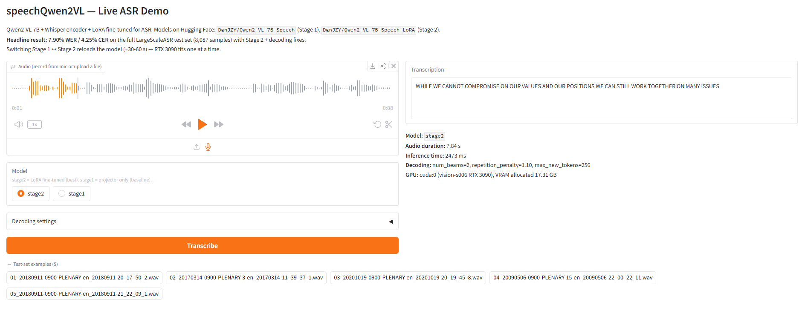

# speechQwen2VL

Fine-tuning [Qwen2-VL-7B](https://huggingface.co/Qwen/Qwen2-VL-7B-Instruct) for speech understanding (ASR) by adding an audio encoder and training in two stages.

## Results

Evaluated on the full [speechbrain/LargeScaleASR](https://huggingface.co/datasets/speechbrain/LargeScaleASR) test set (8,087 samples):

| Model | WER | CER |
|-------|-----|-----|
| Stage 1 — Projector only | 12.89% | 7.43% |
| Stage 2 — LoRA fine-tuned | 8.67% | 4.75% |
| Stage 2 + decoding fixes | **7.90%** | **4.25%** |

Decoding fixes: `repetition_penalty=1.1`, `num_beams=2` (no retraining needed).

## Architecture

The model extends Qwen2-VL-7B with audio capabilities:

- **Audio encoder**: Whisper encoder (frozen) — extracts audio features
- **Audio projector**: Learned MLP (~17M params) — maps Whisper features to Qwen2-VL's embedding space
- **LLM decoder**: Qwen2-VL-7B — generates text from audio + text inputs

### Training stages

**Stage 1** — Train audio projector only (0.19% of params). Teaches the model to map audio representations to text. ~1.5h on 6 GPUs.

**Stage 2** — LoRA fine-tune LLM decoder + continue training projector (2.1% of params). Adapts the language model for ASR. ~5.5h on 6 GPUs.

## HuggingFace Models

| Repository | What it contains | Size |
|------------|------------------|------|
| [`DanJZY/Qwen2-VL-7B-Speech`](https://huggingface.co/DanJZY/Qwen2-VL-7B-Speech) | Full model with trained audio projector (Stage 1) | ~17 GB |
| [`DanJZY/Qwen2-VL-7B-Speech-LoRA`](https://huggingface.co/DanJZY/Qwen2-VL-7B-Speech-LoRA) | LoRA adapters only (Stage 2). **Requires the base model above.** | ~700 MB |

## Quick Start

### Inference

```python
import torch
from transformers import Qwen2VLForConditionalGeneration, Qwen2VLProcessor
from peft import PeftModel
from qwen_vl_utils import process_vision_info

# Load Stage 2 model (base + LoRA adapters)
base_model = Qwen2VLForConditionalGeneration.from_pretrained(
    "DanJZY/Qwen2-VL-7B-Speech", torch_dtype=torch.bfloat16, device_map="cuda",
)
model = PeftModel.from_pretrained(base_model, "DanJZY/Qwen2-VL-7B-Speech-LoRA")
model.eval()
processor = Qwen2VLProcessor.from_pretrained("DanJZY/Qwen2-VL-7B-Speech")

# Transcribe audio
messages = [
    {"role": "user", "content": [
        {"type": "audio", "audio": "path/to/audio.wav"},
        {"type": "text", "text": "Transcribe this audio."},
    ]},
]

image_inputs, video_inputs, audio_inputs = process_vision_info(messages)
text = processor.apply_chat_template(messages, tokenize=False, add_generation_prompt=True)
batch = processor(text=[text], audios=audio_inputs, return_tensors="pt", padding=True)
batch = {k: v.to(model.device) if isinstance(v, torch.Tensor) else v for k, v in batch.items()}

with torch.inference_mode():
    output_ids = model.generate(
        **batch, max_new_tokens=256, num_beams=2,
        do_sample=False, repetition_penalty=1.1,
    )
prompt_len = batch["input_ids"].shape[1]
transcription = processor.batch_decode(output_ids[:, prompt_len:], skip_special_tokens=True)[0]
print(transcription)
```

### Stage 1 only (no LoRA)

```python
model = Qwen2VLForConditionalGeneration.from_pretrained(
    "DanJZY/Qwen2-VL-7B-Speech", torch_dtype=torch.bfloat16, device_map="cuda",
)
```

## Setup

There are two paths depending on how strictly you need to reproduce our env.

### Path A — exact reproduction (recommended for evaluation / paper-style replication)

Uses pinned conda manifest + a `pip freeze` lockfile + commit-pinned forks.

```bash
# 1. Conda side (Python, CUDA, audio system libraries)
conda env create -f environment.yml
conda activate speech_qwen2vl

# 2. Pip side — install the exact transitive versions that worked for us
pip install -r requirements.lock.txt \
    --extra-index-url https://download.pytorch.org/whl/cu121

# 3. Forks — pinned to specific commit hashes inside the script
bash scripts/setup_forks.sh
```

### Path B — development install (recommended if you'll be editing deps)

Uses the human-curated top-level pins; lets pip resolve transitive versions.

```bash
conda env create -f environment.yml          # also runs `pip install -r requirements.txt`
conda activate speech_qwen2vl
bash scripts/setup_forks.sh
```

If the pip install step fails (flash-attn build issue), see `Documentation/Session5_Progress_20260306.md` for the manual 3-stage install.

### What each environment file is for

| File | Edited by | Pins | Use for |
|---|---|---|---|
| `environment.yml` | human | conda top-level (Python, CUDA, ffmpeg, libsndfile) | both paths — defines the conda env |
| `requirements.txt` | human | pip top-level with `==` | Path B (and Path A pulls it via `environment.yml`) |
| `requirements.lock.txt` | auto (`scripts/freeze_lockfile.py`) | every transitive pip dep at exact version | Path A (exact reproduction) |
| `scripts/setup_forks.sh` | human | fork commit hashes (`TRANSFORMERS_COMMIT`, `QWEN_VL_COMMIT`) | both paths — installs the audio-modified forks |

After installing or upgrading any pip package, regenerate the lockfile:

```bash
python scripts/freeze_lockfile.py
```

### Set up data directories

```bash
# On a server with local SSDs (recommended):
mkdir -p /path/to/local/ssd/data /path/to/local/ssd/checkpoints
ln -s /path/to/local/ssd/data ./data
ln -s /path/to/local/ssd/checkpoints ./checkpoints

# Or just use local directories:
mkdir -p data checkpoints
```

## Training

### Stage 1 — Audio projector

```bash
python scripts/train_stage1.py --num_evals 5
```

### Stage 2 — LoRA fine-tuning

```bash
python scripts/train_stage2.py --num_evals 10
```

Both scripts auto-detect idle GPUs and launch DDP training. See `--help` for all arguments.

## Evaluation

```bash
# Full test set, greedy decoding
python scripts/evaluate.py --model stage2 --gpu 0

# With decoding fixes (recommended)
python scripts/evaluate.py --model stage2 --gpu 0 --repetition_penalty 1.1 --num_beams 2

# Compare Stage 1 vs Stage 2
python scripts/evaluate.py --model both --n_samples 100 --gpu 0
```

Or use `notebooks/07_evaluation.ipynb` for interactive analysis with plots and error inspection.

## Live Demo



A small Gradio app for trying the model interactively in a browser — record from your mic, upload a `.wav`, or pick from preloaded test-set examples.

```bash
# On the GPU server:
conda activate speech_qwen2vl
python scripts/serve.py --gpu 0
# → loads stage2 + LoRA, opens http://127.0.0.1:7870

# From a remote machine, tunnel the port:
ssh -L 7870:localhost:7870 <server>
# then open http://localhost:7870 in your local browser
```

The UI lets you:
- Record audio with the browser mic, or upload an audio file
- Switch between Stage 1 and Stage 2 (reloads the model — Stage 2 needs ~17 GB VRAM, fits on a 24 GB card)
- Tune `repetition_penalty`, `num_beams`, `max_new_tokens` live
- Replay a few preloaded test-set samples (regenerate them with `python scripts/extract_demo_samples.py`)

## Repository Structure

```
notebooks/
  01-04  Exploration notebooks (data, tokenizer, model architecture, inference)
  05     Stage 1 training notebook
  06     Stage 2 LoRA training notebook
  07     Evaluation notebook (WER/CER metrics, error analysis)

scripts/
  train_stage1.py       Multi-GPU DDP training (Stage 1)
  train_stage2.py       Multi-GPU DDP training (Stage 2)
  evaluate.py           CLI evaluation script
  serve.py              Gradio demo backend (live transcription UI)
  extract_demo_samples.py  Pull a few short test-set wavs for the demo
  freeze_lockfile.py    Regenerate requirements.lock.txt from current env
  setup_forks.sh        Install forked transformers & qwen-vl-utils

Documentation/
  Session*_Progress_*   Detailed session logs with reproduction steps
  Session*_Plan.md      Planning documents
  Lessons/              Q&A and lessons learned per session
```

## Dataset

[speechbrain/LargeScaleASR](https://huggingface.co/datasets/speechbrain/LargeScaleASR) — `small` split:
- Training: 72 shards (~107K samples)
- Test: 6 shards (8,087 samples)

## Dependencies

Key dependencies (see `requirements.txt` for full list):
- PyTorch 2.4.1 + CUDA 12.1
- Transformers (forked, with audio support)
- PEFT 0.17.1
- Flash Attention 2.6.3
- jiwer (WER/CER evaluation)

## Notes

- `requirements.lock.txt` is a `pip freeze` snapshot, not hash-protected — `flash-attn` builds from source with no prebuilt wheels, so `pip-compile --generate-hashes` and `conda-lock` cannot fully lock this stack.
- The HuggingFace model weights (`DanJZY/Qwen2-VL-7B-Speech` and the LoRA adapter) live on HF Hub — they are not in this repo.
- `scripts/setup_forks.sh` pins forks to specific commit hashes (`git checkout --detach <SHA>`), so future pushes to the `speech-qwen2vl` branches will not silently change what gets installed.

## Citation

If you find this project useful, please consider citing it:

```bibtex
@software{jiang2026speechqwen2vl,
  author = {Zhuoyuan Jiang},
  title  = {speechQwen2VL: A Speech-Enabled Qwen2-VL-7B Foundation Model},
  year   = {2026},
  url    = {https://github.com/ZhuoyuanJiang/speechQwen2VL}
}
```
